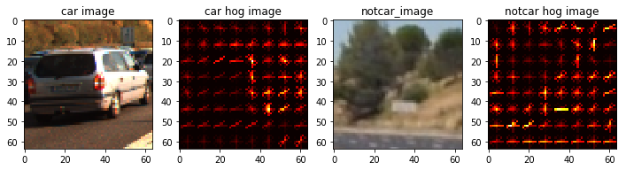
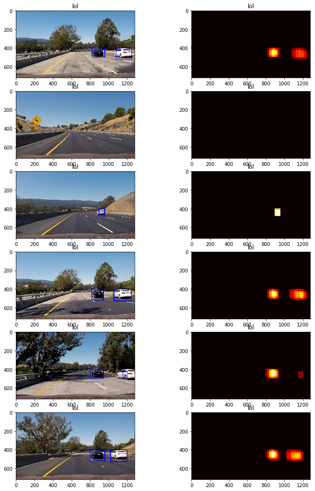

##Writeup Template
###You can use this file as a template for your writeup if you want to submit it as a markdown file, but feel free to use some other method and submit a pdf if you prefer.

---

**Vehicle Detection Project**

The goals / steps of this project are the following:

* Perform a Histogram of Oriented Gradients (HOG) feature extraction on a labeled training set of images and train a classifier Linear SVM classifier
* Optionally, you can also apply a color transform and append binned color features, as well as histograms of color, to your HOG feature vector. 
* Note: for those first two steps don't forget to normalize your features and randomize a selection for training and testing.
* Implement a sliding-window technique and use your trained classifier to search for vehicles in images.
* Run your pipeline on a video stream (start with the test_video.mp4 and later implement on full project_video.mp4) and create a heat map of recurring detections frame by frame to reject outliers and follow detected vehicles.
* Estimate a bounding box for vehicles detected.

[//]: # (Image References)
[image1]: ./examples/car_not_car.png
[image2]: ./examples/HOG_example.jpg
[image3]: ./examples/sliding_windows.jpg
[image4]: ./examples/sliding_window.jpg
[image5]: ./examples/bboxes_and_heat.png
[image6]: ./examples/labels_map.png
[image7]: ./examples/output_bboxes.png
[video1]: ./project_video.mp4

## [Rubric](https://review.udacity.com/#!/rubrics/513/view) Points
###Here I will consider the rubric points individually and describe how I addressed each point in my implementation.  

---
###Writeup / README

####1. Provide a Writeup / README that includes all the rubric points and how you addressed each one.  You can submit your writeup as markdown or pdf.  [Here](https://github.com/udacity/CarND-Vehicle-Detection/blob/master/writeup_template.md) is a template writeup for this project you can use as a guide and a starting point.  

You're reading it!

###Histogram of Oriented Gradients (HOG)

####1. Explain how (and identify where in your code) you extracted HOG features from the training images.

The code for this step is contained in the code cell of the IPython notebook that is labeled "HOG features" and in the `single_img_features` method of the code block titled "Helper Functions." `single_img_features` calls `get_hot_features` which calls `skimage`'s hog function. The HOG image is crucial for training out classifier because HOG does a very good job of creating a "shape" signature. This is because the shape is determined by a gradient change in color which is normally associated with sharp, distinct lines. This is something that most automobiles have.  

I then explored different color spaces and different `skimage.hog()` parameters (`orientations`, `pixels_per_cell`, and `cells_per_block`).  I grabbed random images from each of the two classes and displayed them to get a feel for what the `skimage.hog()` output looks like.

Here is an example using the `YCrCb` color space and HOG parameters of `orientations=9`, `pixels_per_cell=(8, 8)` and `cells_per_block=(2, 2)`:

####2. Explain how you settled on your final choice of HOG parameters.

After experimenting with many color spaces and going through the project Q&A I found that the YCrCb color space worked best. I did not experiment much with the HOG parameters, I set the orientations to 9 because that is what they used in the class videos. The class videos also mentioned that anything more than 9 is not useful. I used 8x8 pixels per cell because the images were 64x64 and I did 2x2 cells per block. I found that these parameters fit in well with the math and it reduced my own mental overhead.

####3. Describe how (and identify where in your code) you trained a classifier using your selected HOG features (and color features if you used them).

I trained a linear SVC using the HOG, spatial, and color features of the car and not car images. This code can be seen in the code block titled 'Training a classifier using SVC.' I used a `spatial_size` of 32x32. I then took all of the non-car and car features, concatenated all of them up, and shuffled them into training, and test data. 20% of the features were set aside for test data. In the end, my linear svc had a test accuracy of 99.04%.

###Sliding Window Search

####1. Describe how (and identify where in your code) you implemented a sliding window search.  How did you decide what scales to search and how much to overlap windows?

The sliding window search part of this project was the most difficult for me and most difficult to understand. It was difficult to understand how I would execute the more advanced techniques like calculating a centroid and only searching certain parts of the screen at certain scales. The centroid problem was not an issue as soon as I had my heatmap. I did not bother with mapping scales to different parts of the screen. 

I made sure to only search through the road portions of the images so I had a `ystart` of 400 and `ystop` of 656. The actual sliding window algorithm is fairly simple, it's just a box that slides accross the screen and runs the subimg against the classifier (There is an overlap parameter that you can tune here). This code is in the `find_cars` method. The important bit is combining the scales. The scales I used for my project were `[1.5, 1, 1.25, 2]` In retrospect I should have added a <1 scale in there to get the smaller detections. The additional scales allowed to me increase my heatmap threshold to 3. I set the overlap to be 2 cells per step.

####2. Show some examples of test images to demonstrate how your pipeline is working.  What did you do to optimize the performance of your classifier?

Ultimately I searched on 4 scales using YCrCb 3-channel HOG features plus spatially binned color and histograms of color in the feature vector, which provided a nice result.  Here are some example images:

---

### Video Implementation

####1. Provide a link to your final video output.  Your pipeline should perform reasonably well on the entire project video (somewhat wobbly or unstable bounding boxes are ok as long as you are identifying the vehicles most of the time with minimal false positives.)
Here's a [link to my video result](./test2.mp4)

####2. Describe how (and identify where in your code) you implemented some kind of filter for false positives and some method for combining overlapping bounding boxes.

I recorded the positions of positive detections in each frame of the video.  From the positive detections I created a heatmap and then thresholded that map to identify vehicle positions.  I then used `scipy.ndimage.measurements.label()` to identify individual blobs in the heatmap.  I then assumed each blob corresponded to a vehicle.  I constructed bounding boxes to cover the area of each blob detected.  

You can refer to the previous image for the heatmaps. Because I used 4 scales it allowed me to use a higher threshold. I only had about one false detection in the shadows when the car was jumping up and down. This false detection probably could have been avoided by detecting that it was only in one frame. 

I also tried to average out the frames to avoid the boxes from jumping around all over the place. I had trouble with this part of the implementation, mainly because this was hitting the limits of my python skills. Luckily, I was able to use code from this project, https://github.com/darienmt/CarND-Vehicle-Detection-P5/blob/master/Vehicle%20Detection.ipynb . This essentially keeps a running average of the last 3 frames. 

---

###Discussion

####1. Briefly discuss any problems / issues you faced in your implementation of this project.  Where will your pipeline likely fail?  What could you do to make it more robust?

This pipeline would fail if we had an uphill road, because it is only searching on a hardset boundary. It would also fail if we saw a car that didn't match any type of vehicle that did not match any of our feature set. This could be solved by having a more robust dataset. Although, I do think that the dataset was already pretty robust and any non-classifcations would be rare. My algorithim is also limited by smaller scales, this is easily mitigated by adding more scales. 
